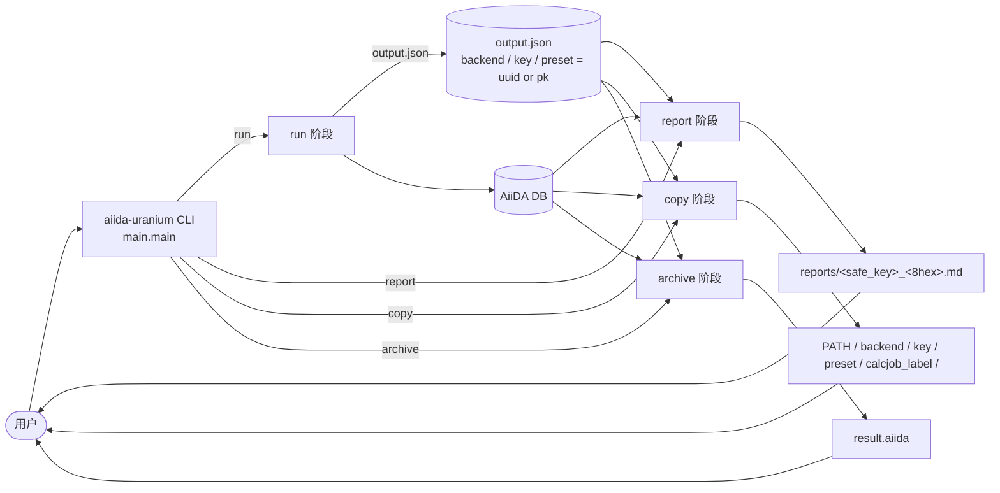
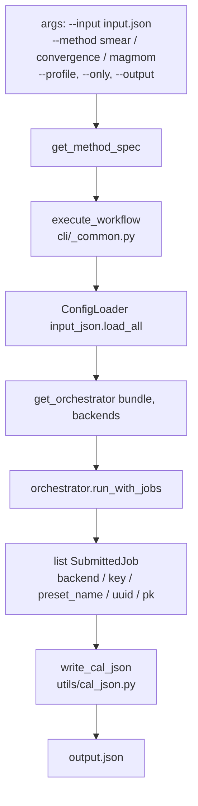
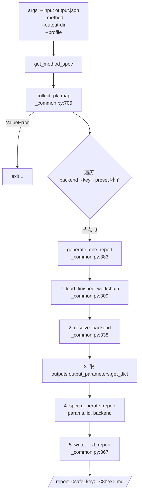
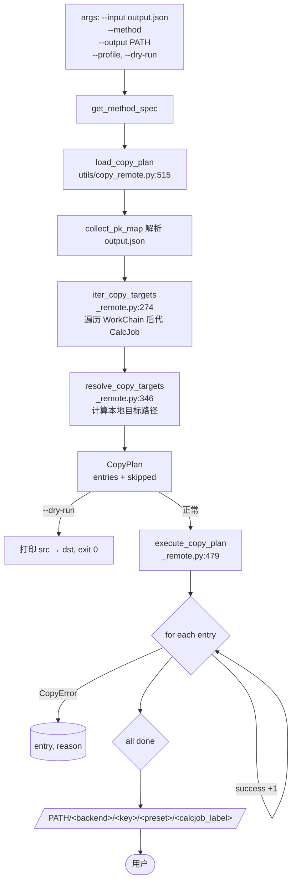
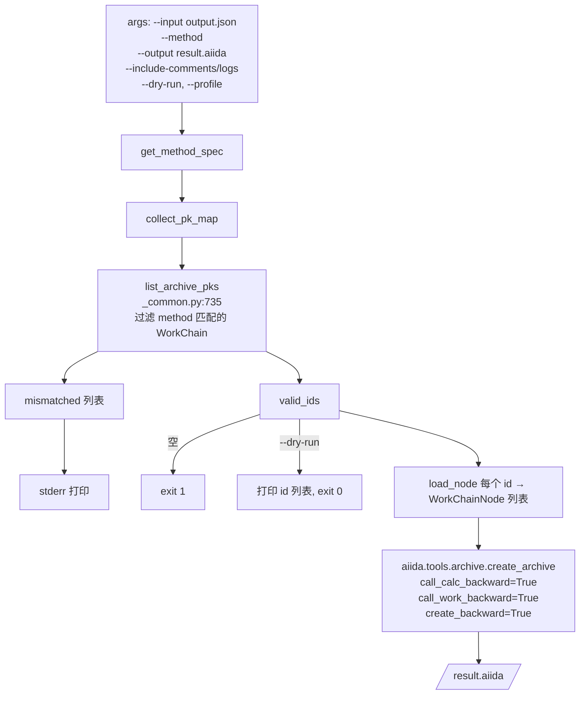

# 整体 Workflow 概览

> 统一 CLI：`aiida-uranium {run, report, copy, archive} --method {smear, convergence, magmom}`
>
> 所有方法特定元数据集中在 [`cli/_common.METHOD_SPECS`](../../src/aiida_uranium_workflow/cli/_common.py)，新方法只需扩展该字典。

## 1. 顶层数据流（Run → Report / Copy / Archive）



`output.json` 是 4 个阶段共享的**唯一中间文件**，结构：

```json
{ "<backend>": { "<key>": { "<preset_name>": "<WorkChain uuid|pk>" } } }
```

---

## 2. `run` —— 提交 WorkChain 并写 `output.json`

**入口**：[`_run()`](../../src/aiida_uranium_workflow/cli/main.py#L59-L85)



**关键函数**

| 调用 | 位置 | 输入 | 输出 |
|---|---|---|---|
| `get_method_spec(method)` | `cli/_common.py:125` | `method: str` | `MethodSpec` (name / `backend_to_key` / `class_to_backend` / `generate_report`) |
| `execute_workflow(*, input_json, profile, only)` | `cli/_common.py:200` | JSON 路径、AiiDA profile、可选 backend 过滤 | `list[SubmittedJob]` |
| `default_result_path(input_json)` | `cli/_common.py:730` | 输入 JSON 路径 | `<input>.final_cal.json` 路径 |
| `write_cal_json(submitted, output_path, workflow, backend_to_key)` | `utils/cal_json.py:106` | 提交结果列表 + 路径 | 写盘 `output.json` |
| `build_cal_json(submitted, *, workflow, backend_to_key)` | `utils/cal_json.py:74` | `Iterable[SubmittedJob]` | `OrderedDict` 嵌套结构 |

**返回**：`int` 退出码（0 = 全部提交成功，1 = 无可提交）。

---

## 3. `report` —— 从 `output.json` 生成 Markdown 报告

**入口**：[`_report()`](../../src/aiida_uranium_workflow/cli/main.py#L88-L141)



**关键函数**

| 调用 | 位置 | 输入 | 输出 |
|---|---|---|---|
| `collect_pk_map(input_path)` | `cli/_common.py:705` | `output.json` 路径 | 嵌套 dict |
| `generate_one_report(*, node_identifier, output_path, profile, class_to_backend, generate_report)` | `cli/_common.py:383` | 单个 WorkChain 节点 id（UUID 或 pk） | 状态字符串 `ok -> <path>` / `failed: ...` / `skipped: ...` |
| `load_finished_workchain(id, profile)` | `cli/_common.py:309` | 节点 id、profile | `(workchain, status)` 二元组 |
| `resolve_backend(class_name, class_to_backend)` | `cli/_common.py:338` | WorkChain 类名 | `"abacus"` / `"vasp"` / `None` |
| `write_text_report(text, path)` | `cli/_common.py:367` | 文本与目标路径 | 布尔（写盘成功？） |
| `generate_report(output_parameters, node_id, backend)` | `utils/report/{smear,convergence,magmom}.py` | 输出参数 | Markdown 字符串 |

**输出目录**：`<input>.parent/reports/report_<safe_key>_<8hex>.md`

---

## 4. `copy` —— 把 `remote_folder` 拷贝到本地

**入口**：[`_copy()`](../../src/aiida_uranium_workflow/cli/main.py#L209-L270)



**关键函数**

| 调用 | 位置 | 输入 | 输出 |
|---|---|---|---|
| `load_copy_plan(*, input_json, method, class_to_backend, base_dir)` | `utils/copy_remote.py:515` | `output.json`、方法名、base 目录 | `CopyPlan`（entries + skipped） |
| `iter_copy_targets(...)` | `utils/copy_remote.py:274` | `output.json` 解析结果、WorkChain 类映射 | `Iterator[CopyTarget]` |
| `resolve_copy_targets(targets, base_dir)` | `utils/copy_remote.py:346` | targets、base 目录 | `list[CopyPlanEntry]` |
| `build_local_path(...)` | `utils/copy_remote.py:120` | backend/key/preset/calcjob 标签 | 本地路径 |
| `execute_copy_plan(entries, *, transport_factory=None)` | `utils/copy_remote.py:479` | `Sequence[CopyPlanEntry]` | `(success_count, [(entry, reason), ...])` |
| `copy_remote_folder_to_local(remote, path, transport_factory)` | `utils/copy_remote.py:416` | AiiDA `RemoteData`、目标路径 | 真正执行 `Transport.get` |

**本地路径布局**：

```
<base_dir>/<backend>/<key>/<preset_name>/<calcjob_label>/
```

**返回**：`int`（0 = 全部成功，1 = 存在失败）。

---

## 5. `archive` —— 打包为 AiiDA 归档文件

**入口**：[`_archive()`](../../src/aiida_uranium_workflow/cli/main.py#L144-L206)



**关键函数**

| 调用 | 位置 | 输入 | 输出 |
|---|---|---|---|
| `collect_pk_map(input_path)` | `cli/_common.py:705` | `output.json` 路径 | 嵌套 dict |
| `list_archive_pks(pk_map, *, method, class_to_backend)` | `cli/_common.py:735` | pk_map、目标方法名 | `(valid_ids, mismatched)` |
| `load_node(node_id)` | `aiida.orm` | UUID 或 pk | `WorkChainNode` |
| `aiida.tools.archive.create_archive(entities, filename, include_comments, include_logs, ...)` | AiiDA 库 | 节点列表 + 元数据 | 写盘 `.aiida` 文件 |

**Archive 配置常量**（来自 [`_archive()`](../../src/aiida_uranium_workflow/cli/main.py#L190-L203)）：

| 字段 | 值 | 含义 |
|---|---|---|
| `include_comments` | `args.include_comments` | 是否包含评论 |
| `include_logs` | `args.include_logs` | 是否包含运行日志 |
| `include_authinfos` | `False` | **始终排除** 计算机凭证（安全） |
| `overwrite` | `True` | 覆盖已存在文件 |
| `call_calc_backward` | `True` | 打包 CalcJob 调用链 |
| `call_work_backward` | `True` | 打包 WorkChain 调用链 |
| `create_backward` | `True` | 包含 create 节点 |
| `input_calc_forward` | `False` | 不包含 CalcJob 输入的前向链 |
| `input_work_forward` | `False` | 不包含 WorkChain 输入的前向链 |
| `return_backward` | `False` | 不包含 return 节点 |

**返回**：`int`（0 = 成功，1 = 无有效 id 或 dry-run 列出后退出）。

---

## 6. 阶段对照表

| 阶段 | CLI handler | 共享输入 | 关键工具 | 产物 |
|---|---|---|---|---|
| run | `_run` | `inputs.json` + YAML | `execute_workflow` / `write_cal_json` | `output.json` |
| report | `_report` | `output.json` | `generate_one_report` / `write_text_report` | `reports/*.md` |
| copy | `_copy` | `output.json` | `load_copy_plan` / `execute_copy_plan` | `PATH/<backend>/<key>/<preset>/<calcjob>/` |
| archive | `_archive` | `output.json` | `list_archive_pks` / `create_archive` | `result.aiida` |

## 7. 通用辅助

| 工具 | 位置 | 用途 |
|---|---|---|
| `get_method_spec(method)` | `cli/_common.py:125` | 解析 `MethodSpec`（name / `backend_to_key` / `class_to_backend` / `generate_report`） |
| `build_unified_parser()` | `cli/_common.py:484` | 构造 4 子命令的 `argparse.ArgumentParser` |
| `collect_pk_map(input_path)` | `cli/_common.py:705` | 读 `output.json` 嵌套结构 |
| `_short_id(identifier)` | `cli/_common.py:351` | UUID → 8-hex 前缀（用于日志可读性） |
| `default_result_path(input_json)` | `cli/_common.py:730` | 默认 `<input>.final_cal.json` |
| `sanitise_path_component(value)` | `utils/copy_remote.py:106` | 路径段非法字符清洗 |
